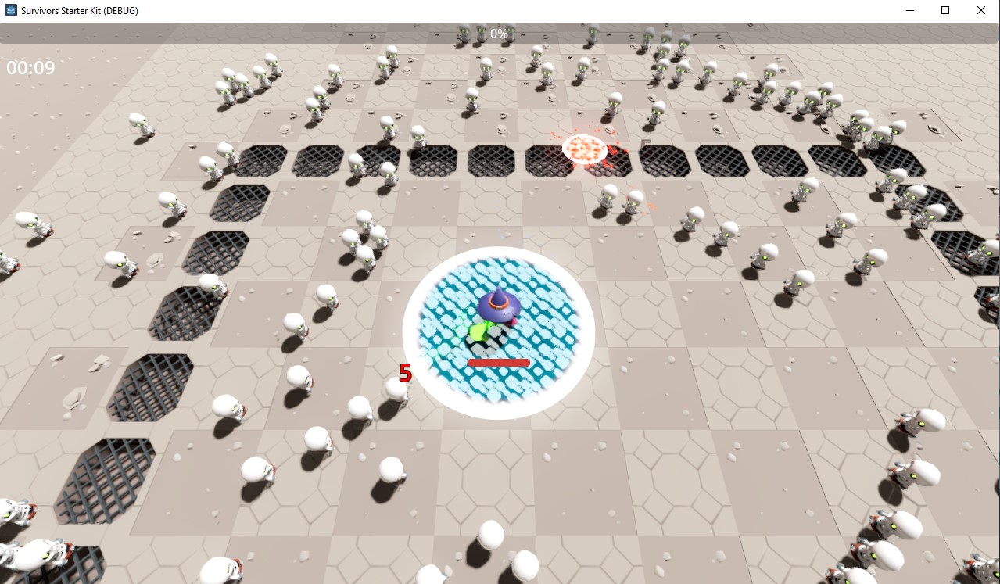
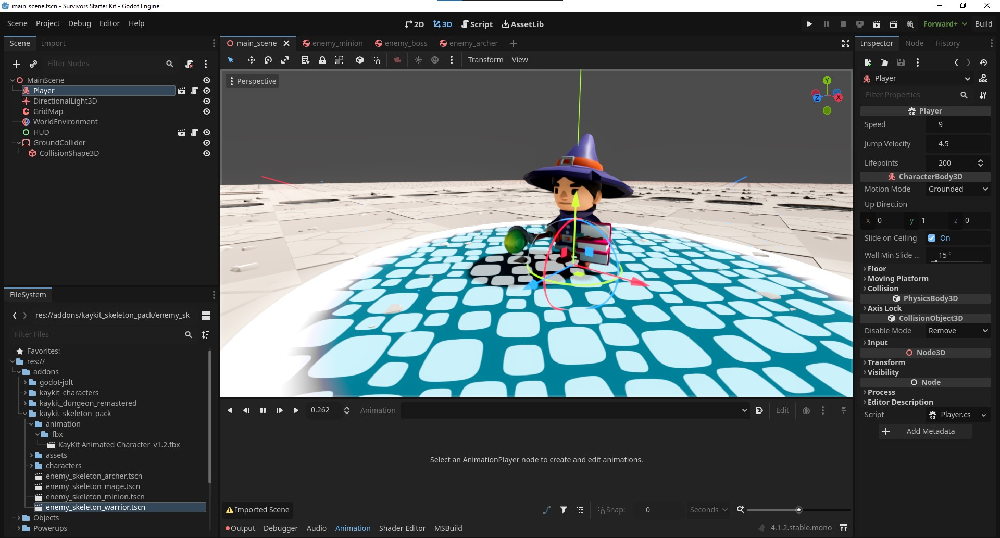
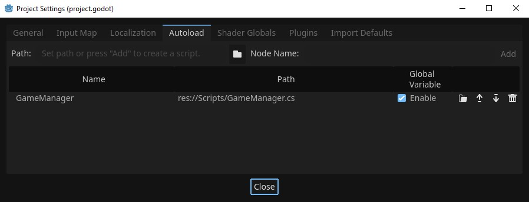

# Survivors Starter Kit, a C# Godot 4 kit

This project is inspired by [Vampire Survivors](https://store.steampowered.com/app/1794680/Vampire_Survivors/). With this starter kit, you can begin creating your own "survivors" game with some basics features :

- Player movement, stats and spells ;
- Enemies and boss spawns and stats ;
- Progression curve ;
- Upgrades (for player and enemies) ; 
- Minimal UI.

**:warning: The project is written in C# (because I'm a Unity game dev and found there wasn't enough C# templates).**

## Project architecture

[WIP]

## Spells

In this starter kit, only 4 spells are available for the player :

- Shooting : a basic bullet spawned by the player and moving to the nearest enemy ;
- Lifesteal : a drain life zone around the player which steal enemy's lifepoints while they stay in ;
- Floating Sphere : a sphere floating around the player *[no way!]* and making damages to every enemies it touches ;
- Spirit Water : a damage zone spawning randomly around the player and damaging every enemies in.

## Enemies

[WIP]

## Troubleshooting

### Q: Opening the project for the first time crashes

A: Yes I don't really know why, but I think this is due to a global reimport of the project and the application of Jolt as the physic engine. Just close and restart the project, it would be ok.

### Q: Why using Jolt?

A: Godot default physic engine is pretty... imprecise. It also is slow compared to Jolt. After many tests, it was impossible to get more than 50 enemies simultaneously with default engine. Using Jolt, I can go to ~200, which is x4 powerful.

### Q: My game is becoming really slow when going above 200 enemies...

A: That's because of the physic engine. I can't turn Jolt into multithread for now (and I don't know how to be honest). That's why I tweaked as much as I can to allow 200 enemies to spawn before lowering the FPS. If you want to improve this flow, I'm opened to pull requests!

## Credits

- [Jolt](https://github.com/godot-jolt/godot-jolt) by [Jorrit Rouwe](https://twitter.com/jrouwe) ;
- [Godot Jolt](https://github.com/godot-jolt/godot-jolt) by Mikael Hermansson and Godot Jolt contributors ;
- [KayKit - Character Animations](https://kaylousberg.itch.io/kaykit-animations) by [Kay Lousberg](https://kaylousberg.com/) ;
- [KayKit - Dungeon Pack](https://kaylousberg.itch.io/kaykit-dungeon) by [Kay Lousberg](https://kaylousberg.com/) ;
- [KayKit - Skeletons Pack ](https://kaylousberg.itch.io/kaykit-skeletons) by [Kay Lousberg](https://kaylousberg.com/) ;
- [Pattern Pack](https://kenney.nl/assets/pattern-pack) by [Kenney](https://kenney.nl/).